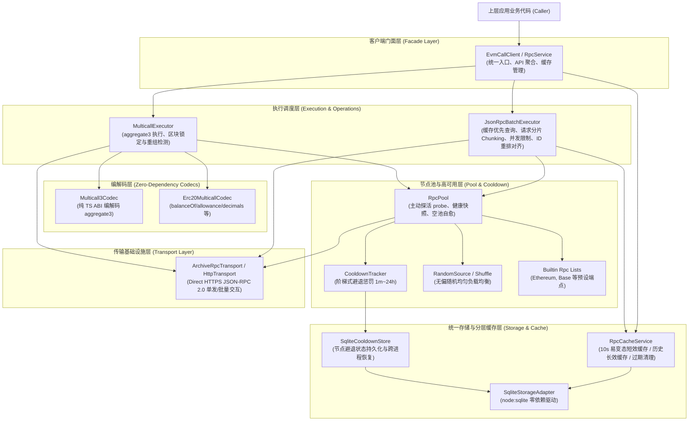
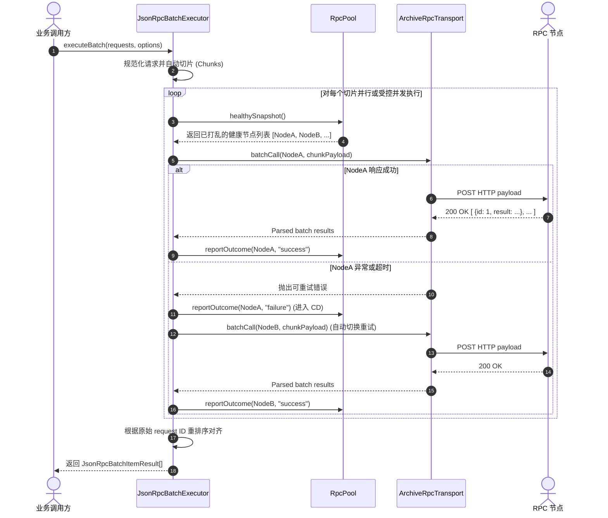

# evm-call 系统架构说明 (System Architecture)

## 1. 架构全景概览 (Architecture Overview)

`evm-call` 采用**模块化、分层解耦、无隐式全局状态**的设计哲学。各模块职责清晰，依赖单向流动，杜绝循环依赖与上帝对象。

---

## 2. 核心分层与职责 (Component Responsibilities)

### 2.1 传输基础设施层 (`src/transport`)
- **`HttpTransport` 接口**: 定义标准 HTTP 请求入参（`HttpRequest`）和响应（`HttpResponse`），屏蔽底层 HTTP 实现细节。
- **`AxiosHttpTransport` / `FetchHttpTransport`**: 遵循 Direct-only 原则，仅发起 HTTPS 请求，不经过任何代理中间件，支持设置超时和 AbortSignal。
- **`ArchiveRpcTransport`**:
  - 拥有 JSON-RPC 2.0 规范的序列化与反序列化职责。
  - 处理单一调用 (`call`) 与原生批量调用 (`batchCall`)。
  - 区分网络层/HTTP 错误与节点层返回的 JSON-RPC 错误信封（`JsonRpcCallError`），不混淆错误语义。

### 2.2 节点池与调度层 (`src/pool` 与 `src/execution`)
- **`CooldownTracker`**:
  - 纯状态逻辑，实现阶梯式指数/倍增惩罚时间（`COOLDOWN_TIERS_MS`：60s, 300s, 900s, 1800s, 3600s, 7200s, 14400s, 28800s, 43200s, 86400s）。
  - 记录连续失败次数 `consecutiveFailures`，计算下一次可试探时间点 `cooldownUntil`。
  - 业务请求一旦成功，立即执行 `recordSuccess()` 恢复。
- **`RandomSource` & `shuffle`**:
  - 基于注入式 `RandomSource` 接口实现 Fisher-Yates 洗牌算法，保证端点选择的无偏性，同时支持单元测试传入伪随机种子实现确定性回放。
- **`RpcPool`**:
  - 统一持有所有配置端点（内置 + 用户注入）。
  - 探活逻辑：`initialize()` 并发探测 `eth_chainId` 与 `eth_getBlockByNumber`。
  - `healthySnapshot()`：过滤掉当前处于 CD 期的节点，对健康节点进行洗牌后返回给执行器。
  - `reportOutcome(id, outcome)`：接收执行器反馈的调用结果，驱动 `CooldownTracker` 状态变迁。

### 2.3 批量与聚合执行层 (`src/batch` 与 `src/multicall`)
- **`JsonRpcBatchExecutor`**:
  - 统一支持常规最新状态与 Archive 历史归档状态的批量请求（如批量拉取历史区块 `eth_getBlockByNumber`、历史账户余额 `eth_getBalance`、历史合约调用 `eth_call`、历史存储插槽 `eth_getStorageAt`、交易收据 `eth_getTransactionReceipt` 等）。
  - 算法流程：`parseJsonRpcRequests` -> `chunk(requests, batchChunkSize)` -> `runBounded(concurrency)`。
  - 故障转移 (Failover)：若端点请求失败且为可重试错误（如网络超时、节点批量超限、瞬时限流），向 Pool 汇报 failure（触发冷却）并自动无缝切换至下一个健康 Archive 端点重试。
  - 对齐恢复：无论节点返回响应的顺序如何，严格按原始 request `id` 重建并对齐结果数组。
- **`EthereumArchiveRpcExecutor`**:
  - 专注于 Archive RPC 特异性高频操作的高可用封装。
  - 纯公共 RPC 时间戳二分查块 (`findBlockNumberByTimestamp`)：根据秒级 Unix 时间戳，二分查找链上对应的历史区块高度，无缝替代 Etherscan 等中心化 API。
  - 最新区块头获取 (`findLatestBlockNumber`)。
  - 历史原生代币余额读取 (`getNativeBalanceAtBlock`)：带 Pre/Post Block Hash 一致性保护。
- **`EthereumMulticall3Codec`**:
  - 完全自主实现的静态与动态 ABI 编码器。
  - 编码 `aggregate3((address,bool,bytes)[])` 为 16 进制字符串。
  - 严格校验返回的数据字对齐、数组长度与单条调用的 `success` 标记。
- **`MulticallExecutor`**:
  - 负责执行 Multicall3 批次，绑定单次请求在同一个 RPC 节点上完成。
  - 锁块与重组检测：执行前后分别请求对应块的 Block Header，确保前后 Block Hash 完全一致，杜绝分叉/重组导致读取到脏状态。

### 2.4 门面层 (`src/client` 或 `src/service`)
- **`EvmCallClient`**:
  - 用户面向的顶层类，聚合 `RpcPool`、`JsonRpcBatchExecutor`、`MulticallExecutor`、`RpcCacheService` 与 Archive 特性。
  - 提供极度简洁易用的 API：
    - 通用及历史调用：`client.call({ method, params }, options?)`
    - 通用及历史批量：`client.batch([ ... ], options?)`、`client.strictBatch([ ... ], options?)`
    - Archive 特色工具：`client.findBlockNumberByTimestamp(timestamp)`、`client.findLatestBlockNumber()`、`client.getNativeBalanceAtBlock(address, blockNumber)`
    - Multicall3 聚合：`client.multicallAtBlock({ blockNumber, calls }, options?)`
    - ERC-20 批量聚合：`client.multicallErc20AtBlock({ blockNumber, calls }, options?)`
    - 缓存与存储管理：`client.cleanExpiredCache()`、`client.pruneCache(filter?)`、`client.clearCache()`、`client.getAllCooldownStates()`

### 2.5 统一存储与分层缓存层 (`src/storage`)
- **`SqliteStorageAdapter`**:
  - 基于 Node.js 原生 `node:sqlite`（`DatabaseSync`），无任何外部 npm C++ 编译依赖，启动与执行极速。
  - 自动初始化并维护两张核心数据表：`evm_cooldown_states` 与 `evm_rpc_cache`。
  - **默认使用本地持久化文件**: 默认路径为 `./data/evm-call.db`（若目录不存在则自动递归创建），绝非默认 `:memory:` 内存模式；`:memory:` 仅在测试或显式配置时启用。
- **`RpcCacheService`**:
  - **请求指纹化**: `cache_key = sha256(chainId + ":" + method + ":" + canonicalParams)`。
  - **分层 TTL 策略**:
    - **短效易变缓存 (Volatile)**: 默认 10 秒，拦截高频重复的最新块/未指定块调用。
    - **长效归档缓存 (Immutable Archive)**: 针对确定性历史区块，默认缓存 7~30 天（或用户指定时长）。
    - **单次显式覆盖**: 支持通过 `options.cacheTtlMs` 临时指定缓存时长，传 `0` 强制穿透刷新。
  - **过期缓存清理与驱逐**:
    - `cleanExpired()`: 执行 `DELETE FROM evm_rpc_cache WHERE expires_at <= ?`，主动释放空间。
    - `prune(options)`: 按链 ID、时间戳、历史类型筛选清理。
- **`SqliteCooldownStore`**:
  - 将节点池的连续失败次数、惩罚截止时间写入 SQLite，节点恢复成功后同步清理。
  - 进程重启或多任务拉起时无缝恢复全池避退状态。

---

## 3. 数据流与时序 (Key Data Flows)

### 3.1 JSON-RPC Batch 调用流程

---

## 4. 错误分类与异常设计体系 (Error Taxonomy)

SDK 统一使用强类型的 `EvmCallError`（继承自原生 `Error`）：
- **`ARCHIVE_RPC_UNAVAILABLE` (可重试)**: 节点网络不通、连接超时、HTTP 5xx、节点显式报错限流。
- **`RPC_BLOCK_NOT_FOUND` (可重试)**: 请求的区块在当前节点尚未同步或归档不完全。
- **`RPC_BLOCK_REORG_DETECTED` (可重试)**: 执行多批次 Multicall 过程中检测到前后块哈希不一致，存在链分叉重组。
- **`RPC_RESPONSE_INVALID` (不可重试)**: 节点返回非法 JSON、缺失结果、未按协议对齐数据。
- **`INVALID_REQUEST` (不可重试)**: 调用方传递的参数校验失败（例如非法的 16 进制地址、非法的调用数据）。
- **`UNSUPPORTED_CHAIN` (不可重试)**: 尝试向未配置或不支持的链发送特异调用。
- **`MULTICALL_NOT_DEPLOYED_AT_BLOCK` (不可重试)**: 目标区块高度早于该链上 Multicall3 官方合约部署高度。
